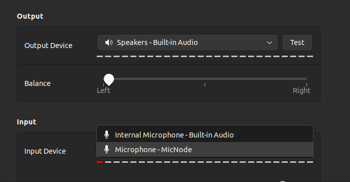

# Creating a USB Microphone with the Raspberry Pi Pico 🎤

This project transforms a Raspberry Pi Pico into a USB microphone using a PDM microphone, enabling the Pico to capture audio data and transmit it over USB to any connected computer.

This project  leverages the Programming I/O (PIO), Direct Memory Access (DMA), and Universal Serial Bus (USB) capabilities of the boards RP2040 microcontroller (MCU) on the pico


## Prerequisites

Before starting, ensure you have the following components:
- Raspberry Pi Pico
- PDM microphone module
- Jumper wires
- Breadboard (generic)

## Wiring Diagram

Connect the PDM microphone to the Raspberry Pi Pico as follows:

| PDM Mic | Raspberry Pi Pico |
|---------|-------------------|
|    3V   |        3V3        |
|    GND  |        GND        |
|    SEL  |        GND        |
|    DAT  |       GPIO2       |
|    CLK  |       GPIO3       |

## Images

### Schematic Diagram and Actual Microphone Setup

<p align="center">
  
  
</p>

### Audacity & System Settings

<p align="center">
  
  
</p>

## Software Setup

To get started with this project, clone the repository and navigate into the project directory:

```bash
git clone https://github.com/dev-sheikh-ali/pico-microphone.git
cd pico-microphone

mkdir build
cd build
cmake ..
make
```

Grab your Raspberry Pi Pico board and a micro USB cable. Plug the cable into your Raspberry Pi or laptop, then press and hold the BOOTSEL button on your Pico while you plug the other end of the micro USB cable into the board. Then release the button after the board is plugged in  disk volume called RPI-RP2 should pop up on your desktop. Double-click to open it, and then drag and drop the UF2 file into it. 

A disk volume called RPI-RP2 should pop up on your desktop. Double-click to open it, and then drag and drop the UF2 file into it. 

or run this command (adjust the path)

```bash
cp -a path/to/usb_microphone.uf2  /media/RPI-RP2/.
```
## Credits

This project is inspired by Sandeep Mistry's tutorial on Hackster.io. Detailed guidance and foundational concepts can be found in the original article: [Create a USB Microphone with the Raspberry Pi Pico](https://www.hackster.io/sandeep-mistry/create-a-usb-microphone-with-the-raspberry-pi-pico-cc9bd5).

For further details on the USB implementation, refer to the ["USB" section of Sandeep Mistry's article](https://www.hackster.io/sandeep-mistry/create-a-usb-microphone-with-the-raspberry-pi-pico-cc9bd5#toc-usb-1).

## Contributing

Contributions are what make the open source community such an amazing place to learn, inspire, and create. Any contributions you make are **greatly appreciated**.

1. Fork the Project
2. Create your Feature Branch (`git checkout -b feature/AmazingFeature`)
3. Commit your Changes (`git commit -m 'Add some AmazingFeature'`)
4. Push to the Branch (`git push origin feature/AmazingFeature`)
5. Open a Pull Request
