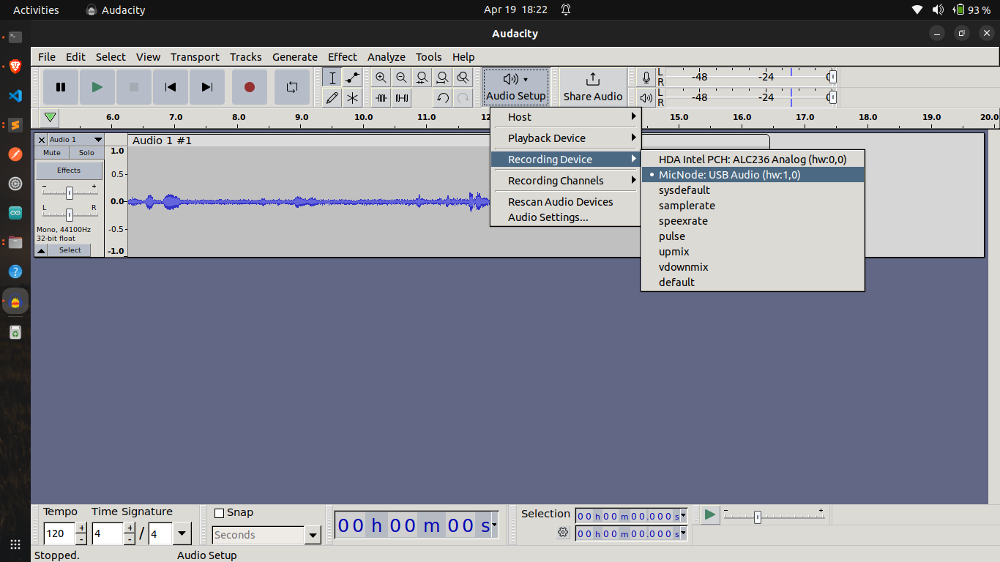

# USB Microphone with Raspberry Pi Pico

This project transforms a Raspberry Pi Pico into a USB microphone using a PDM microphone, enabling the Pico to capture audio data and transmit it over USB to any connected computer.

## Prerequisites

Before starting, ensure you have the following components:
- Raspberry Pi Pico
- PDM microphone module
- Jumper wires

## Wiring Diagram

Connect the PDM microphone to the Raspberry Pi Pico as follows:

| PDM Mic | Raspberry Pi Pico |
|---------|-------------------|
|    3V   |        3V3        |
|    GND  |        GND        |
|    SEL  |        GND        |
|    DAT  |       GPIO2       |
|    CLK  |       GPIO3       |

## Images

### Schematic Diagram and Actual Microphone Setup

<p float="left">
  
   
</p>

### Audacity & System Settings

<p float="left">
  
  
</p>

## Software Setup

To get started with this project, clone the repository and navigate into the project directory:

```bash
git clone https://github.com/dev-sheikh-ali/pico-microphone.git
cd pico-microphone

mkdir build
cd build
cmake ..
make
```
## Credits

This project is inspired by Sandeep Mistry's tutorial on Hackster.io. Detailed guidance and foundational concepts can be found in the original article: [Create a USB Microphone with the Raspberry Pi Pico](https://www.hackster.io/sandeep-mistry/create-a-usb-microphone-with-the-raspberry-pi-pico-cc9bd5).

For further details on the USB implementation, refer to the ["USB" section of Sandeep Mistry's article](https://www.hackster.io/sandeep-mistry/create-a-usb-microphone-with-the-raspberry-pi-pico-cc9bd5#toc-usb-1).

## Contributing

Contributions are what make the open source community such an amazing place to learn, inspire, and create. Any contributions you make are **greatly appreciated**.

1. Fork the Project
2. Create your Feature Branch (`git checkout -b feature/AmazingFeature`)
3. Commit your Changes (`git commit -m 'Add some AmazingFeature'`)
4. Push to the Branch (`git push origin feature/AmazingFeature`)
5. Open a Pull Request